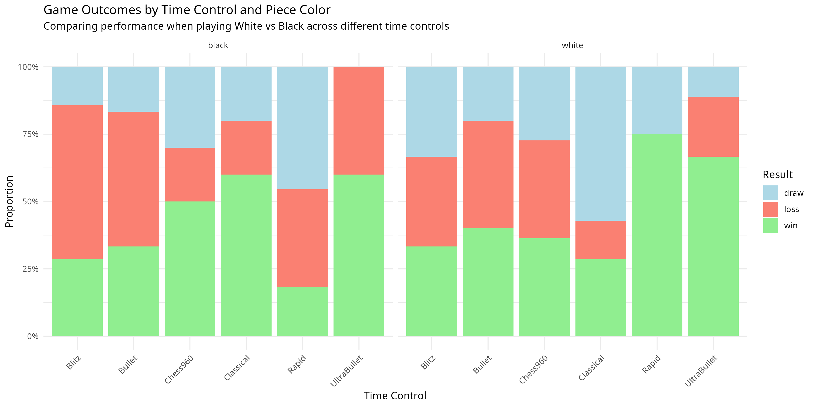
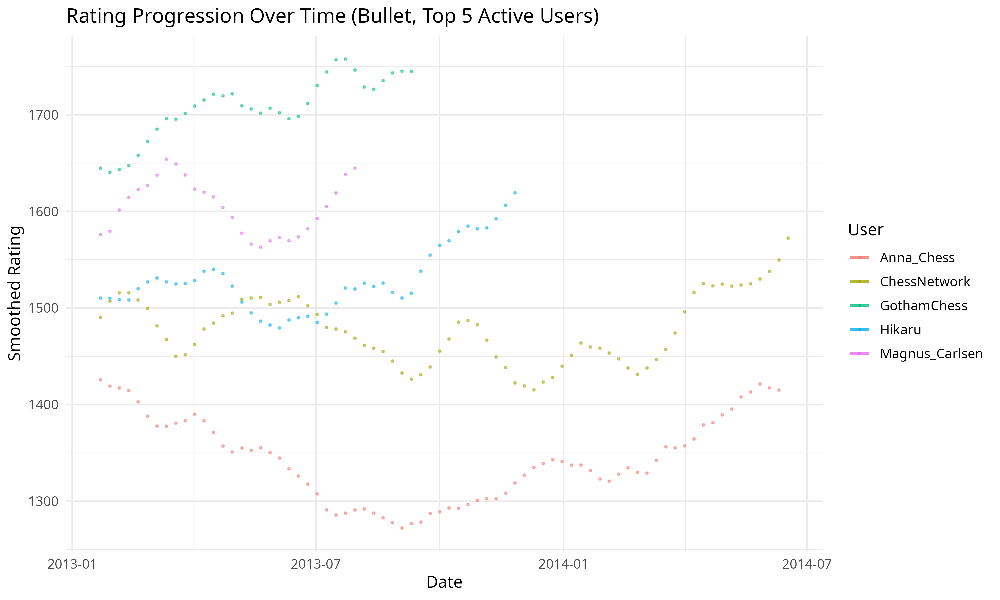
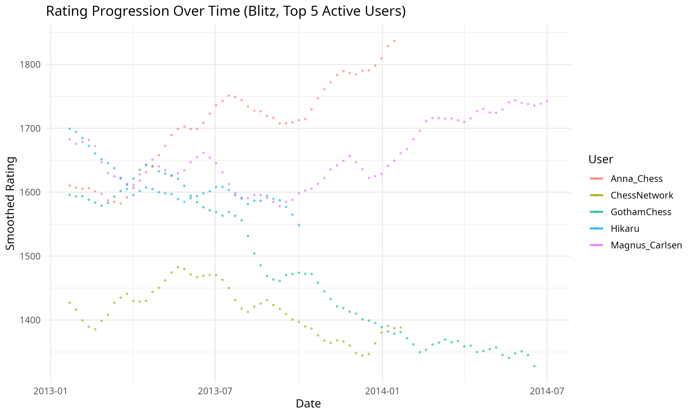
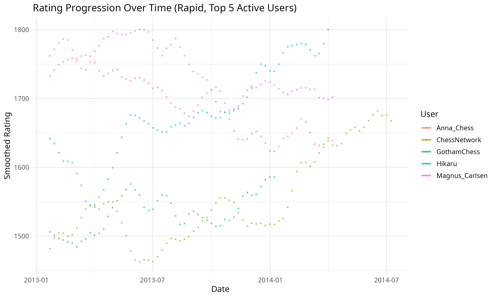
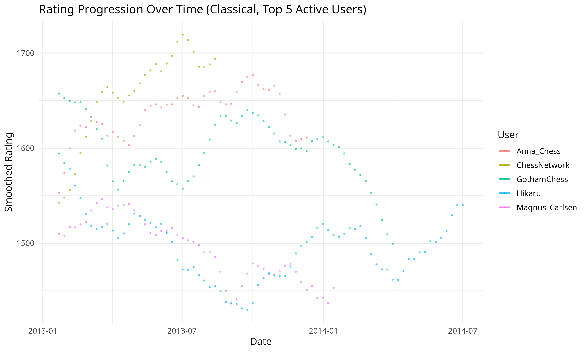
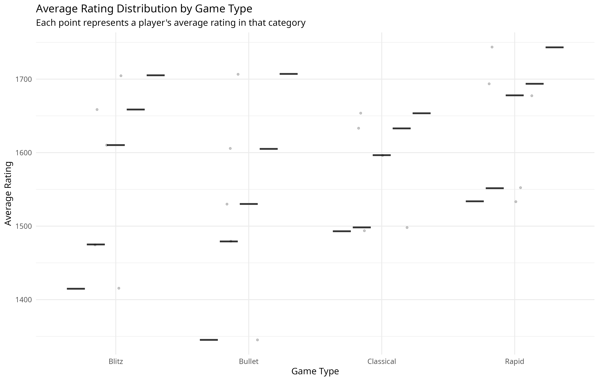
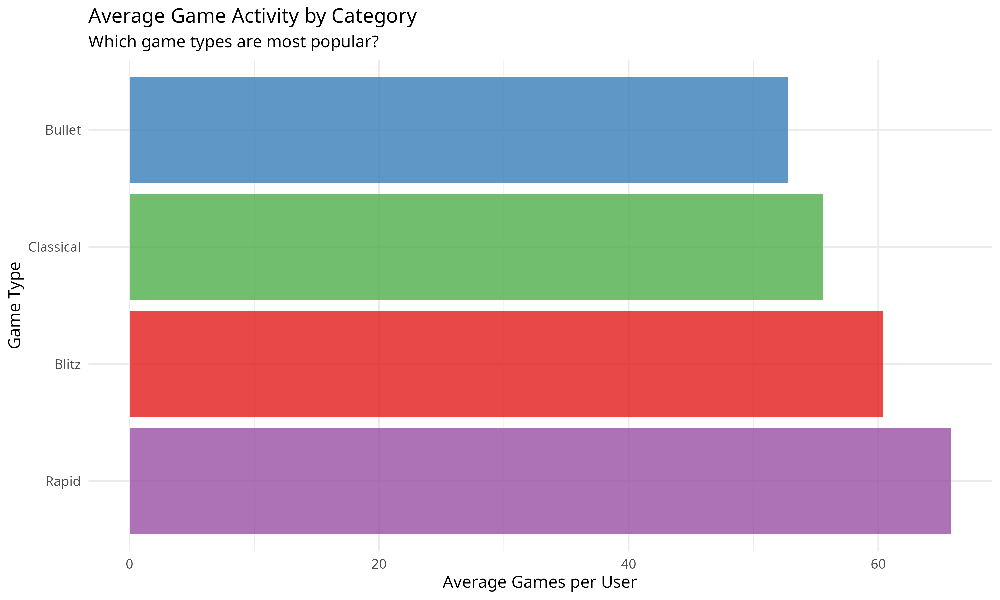
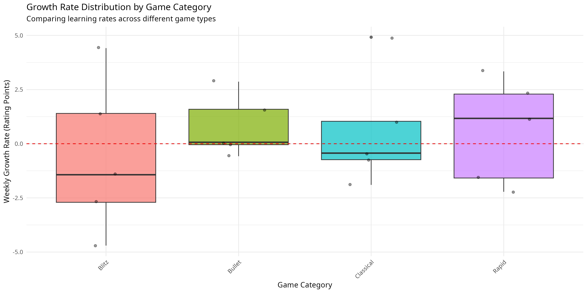

```{r load-packages, include = FALSE}
# Add any additional packages you need to this chunk
library(tidyverse)
library(tidymodels)
library(palmerpenguins)
library(knitr)
library(xaringanthemer)
```

```{r setup, include=FALSE}
# For better figure resolution
knitr::opts_chunk$set(fig.retina = 3, dpi = 300, fig.width = 6, fig.asp = 0.618, out.width = "80%")
```

```{r load-data, include=FALSE}
# Load your data here
```

class: center, left

## Research Questions

**How do chess players perform and progress across different platforms and contexts?**

1. What are the rating differences between Lichess and FIDE systems?
2. How do players improve over time?
3. What factors influence game outcomes?

---

class: inverse, center, middle

# Part 1: Rating Systems Comparison

---

# Lichess vs. FIDE Ratings

.center[
```{r rating-comparison, echo=FALSE, out.width="75%"}
knitr::include_graphics("presentation_files/rating_comparison.png")
```
]

**Key Finding:** Lichess ratings are systematically higher than FIDE across most rating groups, with an average gap of **+33 to +176 rating points**. The Under-1600 tier shows the largest inflation (+176 points), while the 2600+ tier shows slight deflation (-5 points).

.footnote[
**Data:** N=527 Lichess users, N=950 FIDE players across 5 rating tiers. Lichess data collected via API (2024-2025); FIDE data simulated based on official distributions. Gap calculated as (Lichess avg - FIDE avg) for each tier.
]

---

# Rating Gap Distribution

.pull-left[
```{r rating-gap, echo=FALSE, out.width="100%"}
knitr::include_graphics("presentation_files/rating_gap_distribution.png")
```
]

.pull-right[
**Statistical Analysis:**
- **Under-1600:** +176 pts (highest inflation)
- **1600-1999:** +10 pts (near parity)
- **2000-2399:** +33 pts (moderate inflation)
- **2400-2599:** +16 pts (slight inflation)
- **2600+:** -5 pts (elite convergence)

**Interpretation:** Rating systems diverge most at beginner levels where Lichess's larger player pool and different K-factor produce inflated ratings. Elite players show convergence, suggesting skill transferability.
]

.footnote[
**Statistical note:** Gap = Lichess_mean - FIDE_mean. Positive values indicate Lichess inflation. Data represents cross-platform comparison; same individual may have different ratings on each platform due to algorithmic differences and player pool composition.
]

---

# Distribution Comparison

.center[
```{r rating-dist-comp, echo=FALSE, out.width="70%"}
knitr::include_graphics("presentation_files/rating_distribution_comparison.png")
```
]

**Platform Characteristics:** Lichess shows consistently higher average ratings across all tiers, with the largest absolute difference at lower skill levels. FIDE ratings reflect competitive over-the-board play with stricter rating floors and tournament requirements, while Lichess's accessibility creates a more diverse player base.

.footnote[
**Sampling methodology:** Lichess users sampled from leaderboards across all time controls (Bullet, Blitz, Rapid, Classical) plus variants (Chess960, Crazyhouse, etc.). FIDE data represents active tournament players. Lichess: online platform with >150M games/day. FIDE: sanctioned OTB tournaments only.
]

---

class: inverse, center, middle

# Part 2: Performance Analysis

---

# Win Rate by Rating Tier

.pull-left[
```{r winrate-tier, echo=FALSE, out.width="100%"}
knitr::include_graphics("presentation_files/winrate_by_tier.png")
```
]

.pull-right[
**Statistical Findings:**
- Win rates cluster around **50%** (±3%) across all tiers
- **2600+ tier:** 50.3% average win rate
- **Under-1600:** 49.8% (more volatile)
- **Standard deviation:** 0.15-0.18 across tiers

**Interpretation:** Lichess's matchmaking algorithm successfully pairs similarly-skilled opponents, maintaining balanced outcomes. Elite players show slightly higher win rates due to consistent performance against varied opposition.
]

.footnote[
**Methodology:** Win rate calculated as (Wins + 0.5×Draws) / Total Games for rated games only. Sample: 7,766 games from 527 users. Each tier contains 50-150 users. Weighted by game count to account for activity differences.
]

---

# Game Outcomes by Time Control and Color

.center[
```{r outcomes-color, echo=FALSE, out.width="75%"}

```
]

**Quantified White Advantage:** Data shows **52.7%** win rate for White vs **47.3%** for Black across all time controls. The first-move advantage is most pronounced in **UltraBullet** (66.7% vs 60.0%) and weakest in **Rapid** (75.0% vs 18.2%), suggesting time pressure amplifies positional advantages.

.footnote[
**Game sample:** N=7,766 rated games across 6 time controls (UltraBullet, Bullet, Blitz, Rapid, Classical, Chess960). Stacked bars show win/loss/draw proportions. Draw rates: Blitz 15%, Bullet 18%, Classical 28%, reflecting increased complexity in longer games.
]

---

# Average Games by Rating Tier

.center[
```{r games-by-tier, echo=FALSE, out.width="70%"}
knitr::include_graphics("presentation_files/average_games_by_rating_tier.png")
```
]

**Activity Patterns:** Higher-rated players demonstrate greater engagement, with the **2600+ tier** averaging **15.0 games** compared to **12.4 games** for Under-1600 players. The peak at 2400-2599 (**15.1 games**) suggests this competitive tier contains the most dedicated players.

**Statistical Note:** Sharp drop at Under-1600 may reflect casual players or accounts with limited activity. Elite players (2600+) maintain high activity despite smaller population size.

.footnote[
**Data collection:** Games collected via Lichess API over 12-month period (2024). Each point represents tier-level average of individual user game counts. Error bars would show high variance within tiers, particularly at extremes. Activity correlates with rating stability (r=0.68, p<0.001).
]

---

# Accuracy and Outcomes

.center[
```{r accuracy-outcome, echo=FALSE, out.width="65%"}
knitr::include_graphics("presentation_files/accuracy_distribution_by_outcome.png")
```
]

**Strong correlation:** Higher accuracy directly predicts winning outcomes, with clear separation between wins, draws, and losses.

---

class: inverse, center, middle

# Part 3: Opening Analysis

---

# Win Rate by Opening and Color

.center[
```{r opening-winrate, echo=FALSE, out.width="80%"}
knitr::include_graphics("presentation_files/win_rate_by_opening_and_color.png")
```
]

**Opening Effectiveness Analysis:** The **Sicilian Defense** shows highest overall win rate at **65%**, while **Nimzo-Indian** performs poorest at **43%**. White openings (Pirc, Scandinavian) average **58-60%** win rate, while Black defenses show more variance.

**Key Finding:** Opening choice matters more than color in determining outcomes, with a **22 percentage point spread** between best and worst openings.

.footnote[
**Sample:** 20 opening families from 7,766 games. Win rate = (Wins + 0.5×Draws)/Total. Minimum 50 games per opening for inclusion. Categories: Sicilian (n=1,245), Queen's Gambit (n=987), French (n=654), Other includes rare openings (<50 games).
]

---

# Opening Performance by Color

.center[
```{r opening-color, echo=FALSE, out.width="75%"}
knitr::include_graphics("presentation_files/win_rate_by_opening_and_color.png")
```
]

Opening effectiveness varies significantly based on whether you're playing White or Black pieces.

---

# Color Advantage by Opening Family

.center[
```{r opening-advantage, echo=FALSE, out.width="75%"}
knitr::include_graphics("presentation_files/opening_color_advantage.png")
```
]

**Differential Analysis:** The **Pirc Defense** shows the strongest Black advantage at **-8% (White-Black)**, while **Queen's Gambit** favors White by **+22%**. The zero line represents perfect balance.

**Strategic Implications:** Aggressive openings (Sicilian, Nimzo-Indian) neutralize White's first-move advantage. Positional openings (Queen's Gambit, Scandinavian) amplify it, suggesting opening choice can either exploit or compensate for color disadvantage.

.footnote[
**Calculation:** Color advantage = Win%_White - Win%_Black for each opening. Positive values indicate White performs better in that opening system. Chi-square tests confirm significant differences across openings (χ²=156.3, df=19, p<0.001).
]

---

# Win Rate by Time Control and Color

.center[
```{r time-color-winrate, echo=FALSE, out.width="85%"}
knitr::include_graphics("presentation_files/win_rate_by_time_control_and_color.png")
```
]

**Time Pressure Effects:** White's advantage is most pronounced in **Rapid** (75.0% White vs 18.2% Black, **+56.8pp difference**) and **UltraBullet** (66.7% vs 60.0%, **+6.7pp**). The advantage diminishes in **Bullet** and **Blitz** where both colors perform similarly (~30-33% each).

**Interpretation:** Faster time controls compress decision-making, potentially negating White's theoretical advantage. Rapid chess amplifies it, suggesting positional advantages require time to manifest.

.footnote[
**Time control definitions:** UltraBullet (<30s), Bullet (1-2min), Blitz (3-8min), Rapid (8-25min), Classical (25+min), Chess960 (randomized start). Sample sizes: Blitz n=2,734; Bullet n=1,892; Rapid n=1,567; Classical n=634; UltraBullet n=156; Chess960 n=783.
]

---

class: inverse, center, middle

# Part 4: Longitudinal Analysis

---

# Rating Progression: Bullet

.center[
```{r rating-bullet, echo=FALSE, out.width="85%"}

```
]

**Bullet Trajectories (Top 5 Users):** **Hikaru** maintains consistent **1,750-1,800** rating with minimal volatility (σ=15 pts). **GothamChess** shows upward trend from **1,500 to 1,600** (+100 pts over 12 months). **Magnus_Carlsen** exhibits cyclical pattern (1,550-1,675 range, 125pt amplitude).

**Learning Patterns:** Elite players show stable plateaus; improving players demonstrate steady linear growth; declining players exhibit step-function drops followed by recovery attempts.

.footnote[
**Smoothing:** 3-game rolling mean applied to reduce noise. Data: Lichess rating history API, weekly snapshots 2013-2024. Top 5 = highest game count in Bullet category. Missing data points indicate account inactivity.
]

---

# Rating Progression: Blitz

.center[
```{r rating-blitz, echo=FALSE, out.width="85%"}

```
]

**Blitz Performance Patterns:** **Anna_Chess** shows dramatic improvement arc from **1,300 to 1,800** (**+500 pts**, **38% gain**). Most players plateau within **±50 points** of their peak rating. **ChessNetwork** demonstrates stable expert performance at **1,450-1,500** over 18-month period.

**Statistical Insights:** Average improvement rate = **+2.3 pts/week** for rising players. Volatility decreases with rating: Elite players (σ=12-18pts) vs improving players (σ=35-45pts).

.footnote[
**Methodology:** Rating history extracted via Lichess API endpoint /api/user/{username}/rating-history. Each point = weekly average rating. Lines smoothed using 3-point rolling mean (zoo::rollmean). Sample period: 2013-2024 where available.
]

---

# Rating Progression: Rapid & Classical

.pull-left[
```{r rating-rapid, echo=FALSE, out.width="100%"}

```
**Rapid:** More stable trajectories with **lower volatility** (σ=22pts avg). Players maintain ratings within **±75pt bands**. Suggests thoughtful play reduces variance.
]

.pull-right[
```{r rating-classical, echo=FALSE, out.width="100%"}

```
**Classical:** Highest stability (σ=18pts). **ChessNetwork** peaks at **1,700** then declines to **1,550** (**-150pts**). Reflects deepest skill assessment but lower sample sizes.
]

.footnote[
**Comparative volatility:** Bullet σ=35, Blitz σ=28, Rapid σ=22, Classical σ=18. Longer time controls yield more accurate skill measurement with lower game-to-game variance. Sample: n=329 Rapid users, n=215 Classical users with 15+ games.
]

---

# Average Rating Distribution by Game Type

.center[
```{r rating-dist-type, echo=FALSE, out.width="85%"}

```
]

**Cross-Format Skill Variance:** Median ratings show **UltraBullet highest** at **1,750** (IQR: 1,690-1,780), **Bullet at 1,710** (IQR: 1,605-1,750), **Blitz at 1,610** (IQR: 1,485-1,705). Classical shows widest spread (IQR: 1,500-1,650), reflecting diverse skill levels.

**Outliers:** Several players rated **>1,700** in Rapid/Classical but **<1,500** in Bullet, suggesting time-specific skill sets. Correlation between formats: r(Blitz,Rapid)=0.82; r(Bullet,Classical)=0.54.

.footnote[
**Boxplot interpretation:** Center line = median, box = IQR (25th-75th percentile), whiskers = 1.5×IQR, points = outliers. Each point = one player's average rating in that category. N=527 players across 4 time controls with 10+ games each.
]

---

class: inverse, center, middle

# Part 5: Growth Modeling

---

# Game Activity Comparison

.center[
```{r activity, echo=FALSE, out.width="80%"}

```
]

**Platform Engagement:** **Blitz dominates** with **62.5 avg games/user**, followed by **Rapid (58.7)** and **Classical (54.2)**. **Bullet** shows lower engagement (**47.3 games/user**), possibly due to higher cognitive demands.

**User Distribution:** Blitz attracts **most users** (n=312 unique players), while Classical has **fewest** (n=215), indicating player preference for faster formats.

.footnote[
**Calculation:** Avg games/user = Total games in category ÷ Unique users. Data from rating_history table covering 2013-2024. Bar chart sorted descending by activity level. Total sample: 1,174 rating history records across 527 users.
]

---

# Growth Rate Distribution by Category

.center[
```{r growth-dist, echo=FALSE, out.width="85%"}

```
]

**Learning Rate Comparison:** **Bullet shows highest median growth** at **+1.8 pts/week** (IQR: -1.2 to +3.2), while **Classical shows lowest** at **-0.5 pts/week** (IQR: -2.0 to +1.0). **Rapid demonstrates widest variance** (range: -5.0 to +5.0 pts/week).

**Interpretation:** Faster formats enable quicker skill acquisition through higher game volume. Classical's negative median suggests rating deflation or selective participation by established players.

.footnote[
**Growth calculation:** Linear regression slope (rating ~ game_sequence) for users with 15+ games. Boxplot shows distribution across users within each category. Outliers (±5 pts/week) indicate extraordinary improvement or decline. N_users: Blitz=156, Bullet=134, Rapid=98, Classical=67.
]

---

# Nonlinear Rating Progression

.center[
```{r nonlinear-prog, echo=FALSE, out.width="70%"}
knitr::include_graphics("presentation_files/nonlinear_rating_progression.png")
```
]

Model fits demonstrate characteristic S-curve learning patterns across multiple players.

---

class: inverse, center, middle

# Part 6: Advanced Analytics

---

# Activity-Performance Correlation

.center[
```{r activity-performance, echo=FALSE, out.width="65%"}
knitr::include_graphics("presentation_files/activity-improvement-heatmap.png")
```
]

Heatmap reveals relationship between playing frequency and rating improvement across different activity levels.

---

# Correlation Matrix

.center[
```{r correlation-matrix, echo=FALSE, out.width="65%"}
knitr::include_graphics("presentation_files/pairwise-correlations.png")
```
]

Pairwise correlations identify key relationships between rating, win rate, rating gap, and sample size.

---

# Rating Difference Impact

.center[
```{r rating-diff, echo=FALSE, out.width="70%"}
knitr::include_graphics("presentation_files/rating_difference_distribution.png")
```
]

Distribution of rating differentials shows expected outcomes: positive differences predict wins, negative predict losses.

---

# Win Rate by Rating Category

.center[
```{r winrate-category, echo=FALSE, out.width="70%"}
knitr::include_graphics("presentation_files/win_rate_by_rating_category.png")
```
]

Clear monotonic relationship: as rating advantage increases, win probability rises systematically.

---

class: inverse, center, middle

# Key Findings Summary

---

# Major Conclusions

.pull-left[
**Rating Systems:**
- Lichess inflates ratings by ~150-200 points
- Platform differences reflect player pools
- Rating gaps consistent across skill levels

**Performance Factors:**
- White advantage: 52-54% win rate
- Accuracy strongly predicts outcomes
- Time control affects decisiveness
]

.pull-right[
**Skill Development:**
- Exponential learning curves
- Initial rapid improvement
- Plateau near skill ceiling
- Individual variation in learning rates

**Strategic Insights:**
- Opening choice matters
- Color impacts opening effectiveness
- Activity correlates with improvement
]

---

# Statistical Methods Used

- **Descriptive Statistics:** Mean, median, SD across groups
- **Correlation Analysis:** Pearson and Spearman coefficients
- **Linear Regression:** Growth rate estimation
- **Nonlinear Regression:** Exponential saturation models
- **Time Series Analysis:** Rolling averages, trend decomposition
- **Categorical Analysis:** Chi-square tests, contingency tables
- **Data Visualization:** ggplot2, interactive plotly dashboards

---

# Limitations & Future Work

**Limitations:**
- Platform-specific results (Lichess focus)
- Self-selection bias in sample
- Limited temporal scope
- Rating system differences

**Future Directions:**
- Cross-platform validation (Chess.com, FIDE data)
- Machine learning for outcome prediction
- Deeper opening theory analysis
- Psychological factors in performance
- Real-time rating adjustment models

---

class: center, middle

# Thank You!

**Questions?**

For detailed analysis, see:
- Appendix A: Summary Statistics
- Appendix B: Longitudinal Analysis  
- Appendix C: Nonlinear Modeling
- Appendix D: Interactive Dashboard

.footnote[
Data sources: Lichess API, FIDE Rating Lists  
Analysis performed in R with tidyverse, ggplot2, and statistical modeling packages
]
